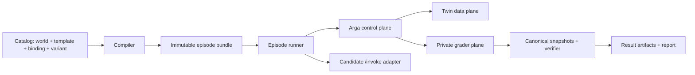

# Architecture

## Boundary

The benchmark repository is a client-side compiler, runner, and evaluator over Arga infrastructure. It must not move benchmark semantics into `validation-server` or assume that Arga already has first-class benchmark models.



## Package responsibilities

- `specs`: Pydantic source of truth for catalog and result contracts.
- `catalog`: load, validate, resolve, and fingerprint declarative benchmark content. No network calls.
- `arga`: the only module that knows Arga endpoints, authentication, scenario registration, sandbox lifecycle, diagnostics, logs, and teardown.
- `agents`: candidate invocation protocols. The first adapter uses synchronous `POST /invoke`.
- `runner`: durable episode state machine, retry policy, cancellation, and teardown.
- `evaluation`: canonical snapshots, state diffs, assertions, collateral-damage detection, and harm classification.
- `providers`: twin-specific canonicalization and semantic normalization.
- `taskpacks`: registered trusted verifiers, gold solutions, and negative controls.
- `reporting`: metric aggregation, confidence intervals, and exports.

Catalog manifests refer to registered verifier and gold IDs. They do not execute arbitrary import paths.

## Episode state machine

```text
PLANNED
  -> MANIFEST_VALIDATED
  -> SCENARIO_REGISTERED
  -> SANDBOX_REQUESTED
  -> DEPLOYMENT_READY
  -> SEED_CONFIRMED
  -> BASELINE_CAPTURED
  -> INVOCATION_STARTED
  -> INVOCATION_FINISHED
  -> FINAL_CAPTURED
  -> GRADED
  -> ARTIFACTS_COMMITTED
  -> TEARDOWN_REQUESTED
  -> COMPLETE
```

Deployment readiness and seed completion are distinct checkpoints. Teardown runs in `finally`. GET operations may retry; sandbox creation and mutation-capable agent invocation must not be retried blindly until they have idempotency contracts.

## Artifact contract

Each episode writes an immutable directory:

```text
runs/<suite-run-id>/<trial-id>/
  manifest.lock.json
  baseline/
  final/
  agent-output.json
  trace.jsonl
  result.json
  infrastructure.log
```

The lock file records hashes for the template, instance, world, binding, seed, verifier, runner, agent commit, and twin images.
