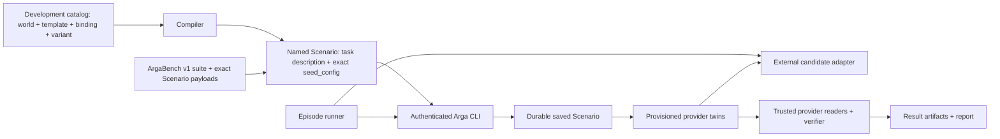

# Architecture

## Boundary

The repository is a client-side compiler, runner, and evaluator. Benchmark semantics stay here. Arga supplies deterministic provider twins, and every Arga control-plane operation goes through the installed CLI.

There are two checked-in task systems. The active `argabench-40-v1` release is
a generated suite with exact Scenario payloads and dedicated runner/reporting
scripts. The older declarative world/template/binding/instance compiler powers
the retained `development_pilot_48_v1` catalog. It remains development tooling,
not the active release.



The runner never calls an Arga server endpoint. Its infrastructure adapter invokes `arga ... --json`. Candidate and verifier traffic goes to provisioned provider APIs; those are twin data-plane operations rather than Arga control-plane operations.

## Package responsibilities

- `specs`: Pydantic source of truth for catalog and result contracts.
- `catalog`: load, validate, compile, and fingerprint declarative content. No network calls.
- `arga_cli`: typed subprocess wrapper for Scenario list/import and twin-run create/status/reset/teardown.
- `agents`: candidate invocation protocol. An adapter may use a process, container, hosted endpoint, or SDK.
- `runner`: durable episode state machine, retry policy, cancellation, and teardown.
- `evaluation`: canonical snapshots, state diffs, predicates, collateral-damage detection, and harm classification.
- `providers`: twin-specific state readers, canonicalization, and semantic normalization.
- `taskpacks`: registered trusted verifiers, gold solutions, and negative controls.
- `reporting`: metric aggregation, confidence intervals, and exports.

Catalog manifests refer to registered verifier and gold IDs. They never execute arbitrary import paths.

## Private runner connection contract

The control process retains the complete CLI response. Its local adapter may
hold a whitelisted connection record such as:

```json
{
  "github": {
    "base_url": "https://pub-example",
    "mcp_url": null,
    "env": {"GITHUB_TOKEN": "twin-native-token"}
  }
}
```

The model does not receive this record, including its base URL or credentials.
It receives provider names/roles and the mediated `provider_api` and
`provider_docs` tool schemas. It never receives `admin_url`, `proxy_token`,
`seed_results`, Arga authentication, fixtures, expected state, verifier code,
or lifecycle controls.

## Episode state machine

```text
PLANNED
  -> MANIFEST_VALIDATED
  -> SCENARIO_SAVED_OR_REUSED
  -> TWIN_RUN_REQUESTED
  -> TWINS_READY_AND_SEEDED
  -> BASELINE_CAPTURED
  -> INVOCATION_STARTED
  -> INVOCATION_FINISHED
  -> FINAL_CAPTURED
  -> GRADED
  -> ARTIFACTS_COMMITTED
  -> TEARDOWN_REQUESTED
  -> COMPLETE
```

The compiler gives each Scenario a stable, readable name, puts the concrete candidate task in `description`, copies checked-in data into `seed_config`, and leaves `Scenario.prompt` unset. A `content-sha256:*` tag identifies the fingerprinted instance bundle. Before provisioning, the runner asks the Arga CLI for that tag: it reuses one matching saved Scenario, imports when none exists, and treats duplicates or mismatched content as an error rather than choosing arbitrarily.

On the audited Arga contract, `twin-runs create --wait` reaches `ready` only after deployment, exact Scenario seeding, and post-seed health checks. The wrapper still checks the JSON status because CLI exit success alone does not distinguish a failed run or wait timeout. Twin-run teardown runs in `finally`, but the saved Scenario remains available for future runs. Mutation-capable candidate invocation is never retried blindly.

The retained development-pilot runner also checks provider-specific identity
bindings before the candidate starts whenever a seed result exposes them.
GitLab Scenario seeding, for example, returns each declared merge request's
project, seed index, physical IID, reference, title, description, and branches.
That runner compares the trusted evidence with the checked-in seed and requires
`iid == seed_index`; missing, duplicate, shifted, or conflicting bindings make
the trial infrastructure-invalid and trigger cleanup without constructing the
candidate gateway. The successful comparison is retained in
`provisioned-fixture-identity.json`. The generic offline semantic grader replays
the comparison from trusted `control.json` evidence and requires the retained
artifact to match it exactly, including an explicit empty binding list for a
zero-merge-request seed. Historical or tampered pilot trials without both
proofs are `invalid_infrastructure` and never contribute a pass, failure, or
unsafe outcome.

## Artifact contract

The active ArgaBench runner writes one profile directory with task-scoped
artifacts:

```text
runs/<matrix>/profiles/<profile>/
  run-config.json
  tasks/<task-id>/
    attempt.json
    control.json
    prompt.json
    baseline-state.json
    invocation.json
    provider-trace.json
    official-docs-trace.json
    tool-steps.json
    final-state.json
    raw-state-diff.json
    cleanup.json
```

Independent repeats use separate `repeat-<n>` roots. Retryable attempts are
moved into `retry-archive/`; they are not overwritten.

The retained development-pilot runner uses a suite root containing
`suite.json`, `prompt-ledger.json`, `summary.json`, `official-docs-cache/`, and
`trials/<trial-id>/` directories with the equivalent control, prompt, snapshot,
invocation, trace, grade, and cleanup records. Suite and task artifacts bind
their exact inputs with SHA-256 identities. CLI output is retained only inside
private artifacts or after credential and token redaction.
