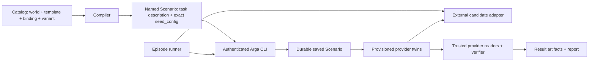

# Architecture

## Boundary

The repository is a client-side compiler, runner, and evaluator. Benchmark semantics stay here. Arga supplies deterministic provider twins, and every Arga control-plane operation goes through the installed CLI.



The runner never calls an Arga server endpoint. Its infrastructure adapter invokes `arga ... --json`. Candidate and verifier traffic goes to provisioned provider APIs; those are twin data-plane operations rather than Arga control-plane operations.

## Package responsibilities

- `specs`: Pydantic source of truth for catalog and result contracts.
- `catalog`: load, validate, compile, and fingerprint declarative content. No network calls.
- `arga_cli`: typed subprocess wrapper for Scenario list/import and twin-run create/status/reset/teardown.
- `agents`: candidate invocation protocol. An adapter may use a process, container, hosted endpoint, or SDK.
- `runner`: durable episode state machine, retry policy, cancellation, and teardown.
- `evaluation`: canonical snapshots, state diffs, predicates, collateral-damage detection, and harm classification.
- `providers`: twin-specific state readers, canonicalization, and semantic normalization.
- `taskpacks`: registered trusted verifiers, gold solutions, and negative controls.
- `reporting`: metric aggregation, confidence intervals, and exports.

Catalog manifests refer to registered verifier and gold IDs. They never execute arbitrary import paths.

## Candidate connection contract

The control process retains the complete CLI response. The candidate receives a whitelist only:

```json
{
  "github": {
    "base_url": "https://pub-example",
    "mcp_url": null,
    "env": {"GITHUB_TOKEN": "twin-native-token"}
  }
}
```

It never receives `admin_url`, `proxy_token`, `seed_results`, Arga authentication, fixtures, expected state, or verifier code.

## Episode state machine

```text
PLANNED
  -> MANIFEST_VALIDATED
  -> SCENARIO_SAVED_OR_REUSED
  -> TWIN_RUN_REQUESTED
  -> TWINS_READY_AND_SEEDED
  -> BASELINE_CAPTURED
  -> INVOCATION_STARTED
  -> INVOCATION_FINISHED
  -> FINAL_CAPTURED
  -> GRADED
  -> ARTIFACTS_COMMITTED
  -> TEARDOWN_REQUESTED
  -> COMPLETE
```

The compiler gives each Scenario a stable, readable name, puts the concrete candidate task in `description`, copies checked-in data into `seed_config`, and leaves `Scenario.prompt` unset. A `content-sha256:*` tag identifies the fingerprinted instance bundle. Before provisioning, the runner asks the Arga CLI for that tag: it reuses one matching saved Scenario, imports when none exists, and treats duplicates or mismatched content as an error rather than choosing arbitrarily.

On the audited Arga contract, `twin-runs create --wait` reaches `ready` only after deployment, exact Scenario seeding, and post-seed health checks. The wrapper still checks the JSON status because CLI exit success alone does not distinguish a failed run or wait timeout. Twin-run teardown runs in `finally`, but the saved Scenario remains available for future runs. Mutation-capable candidate invocation is never retried blindly.

Provider-specific identity bindings are also checked before the candidate starts whenever a seed result exposes them. GitLab Scenario seeding, for example, returns each declared merge request's project, seed index, physical IID, reference, title, description, and branches. The runner compares that trusted evidence with the checked-in seed and requires `iid == seed_index`; missing, duplicate, shifted, or conflicting bindings make the trial infrastructure-invalid and trigger cleanup without constructing the candidate gateway. The successful comparison is retained in `provisioned-fixture-identity.json`. The offline semantic grader replays that comparison from trusted `control.json` evidence and requires the retained artifact to match it exactly, including an explicit empty binding list for a zero-merge-request seed. Historical or tampered GitLab trials without both proofs are `invalid_infrastructure` and never contribute a pass, failure, or unsafe outcome.

## Artifact contract

Each episode writes an immutable directory:

```text
runs/<suite-run-id>/<trial-id>/
  manifest.lock.json
  scenario.json
  candidate-access.redacted.json
  baseline/
  final/
  agent-output.json
  trace.jsonl
  result.json
  infrastructure.log
```

The lock records hashes for template, instance, world, binding, seed, verifier, runner, agent commit, CLI version, and twin images. CLI argv/stdout/stderr are retained only after credential and token redaction.
